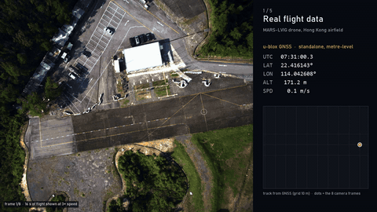

# Yardstick3D

**Real-world scale for 3D foundation models from a cheap GNSS receiver.**



3D foundation models such as [VGGT](https://github.com/facebookresearch/vggt) and
[Depth Anything 3](https://github.com/ByteDance-Seed/Depth-Anything-3) rebuild a scene and its camera path from a few
photos, but only up to an unknown scale. In the demo, VGGT says the drone moved **0.874** units. It actually flew
**92 m**.

Yardstick3D recovers that scale from a standalone u-blox GNSS receiver. Its absolute position is metres off, but the
distances between consecutive fixes are accurate. Comparing those distances with the same camera-to-camera distances
in the model gives one number, the metric scale. The 3D model itself is never fine-tuned.

## Method

For a window of N frames, let `a_k` be the model's camera displacement between frames `k` and `k+1`, and `b_k` the
GNSS path length over the same interval (from the 10 Hz track). The scale is

```
s = ‖b‖ / ‖a‖
```

The camera path and point cloud are multiplied by `s`. Evaluation is RMS position error (ATE) against
centimetre-level RTK after a rotation + translation alignment, with no scale fitted. Two references are reported
alongside:

- **raw:** the model's output without any scaling;
- **Sim(3) floor:** the error with the best possible single scale. No scale estimate can beat this floor, because
  what remains is error in the reconstruction's shape.

The solver only sees the model prediction and the GNSS cue. It never sees ground truth.

## Results

Data: [MARS-LVIG](https://mars.hku.hk/dataset.html) drone flights in Hong Kong (downward camera, u-blox GNSS, RTK
reference). Models: DA3-BASE and VGGT-1B, frozen, pretrained weights.

Every test window and every rule (window selection, solver, gates) was written into a contract and frozen, with its
SHA-256 recorded in [`configs/experiment_registry.json`](configs/experiment_registry.json), before any image, model
output or reference value was seen. Each experiment was scored once; re-scoring is refused by the scripts.

**Site 2, Hong Kong airfield (3 test windows, 16 s and 8 frames each, flights not used before):**

| Model | Window | Flight path | Raw ATE | Grounded ATE | Sim(3) floor | Grounded / floor |
|---|---|--:|--:|--:|--:|--:|
| DA3-BASE | GNSS02 t80 | 47 m | 16.5 m | 1.45 m | 1.38 m | 1.05 |
| DA3-BASE | GNSS03 t112 | 91 m | 31.6 m | 2.10 m | 2.04 m | 1.03 |
| DA3-BASE | GNSS03 t320 | 130 m | 43.9 m | 3.93 m | 3.57 m | 1.10 |
| VGGT-1B | GNSS02 t80 | 47 m | 16.5 m | 1.76 m | 1.75 m | 1.01 |
| VGGT-1B | GNSS03 t112 | 91 m | 31.6 m | 2.27 m | 2.14 m | 1.06 |
| VGGT-1B | GNSS03 t320 | 130 m | 43.9 m | 2.35 m | 2.32 m | 1.01 |

Scale error against the ATE-optimal scale: +2.7 / +1.5 / −3.8 % (DA3) and +1.4 / +2.4 / −0.8 % (VGGT).

**Site 1, Hong Kong island (4 test windows from 3 flights, each a hover↔cruise transition):**

| Model | Window | Flight path | Raw ATE | Grounded ATE | Sim(3) floor | Grounded / floor |
|---|---|--:|--:|--:|--:|--:|
| DA3-BASE | GNSS02 t96 | 33 m | 11.1 m | 2.32 m | 2.14 m | 1.09 |
| DA3-BASE | GNSS02 t384 | 37 m | 11.1 m | 4.70 m | 4.70 m | 1.00 |
| DA3-BASE | GNSS03 t304 | 66 m | 22.1 m | 6.96 m | 6.90 m | 1.01 |
| DA3-BASE | GNSS01 t128 | 36 m | 12.7 m | 0.59 m | 0.58 m | 1.03 |
| VGGT-1B | GNSS02 t96 | 33 m | 11.1 m | 5.82 m | 5.78 m | 1.01 |
| VGGT-1B | GNSS02 t384 | 37 m | 11.1 m | 4.64 m | 4.41 m | 1.05 |
| VGGT-1B | GNSS03 t304 | 66 m | 22.2 m | 9.82 m | 9.21 m | 1.07 |
| VGGT-1B | GNSS01 t128 | 36 m | 12.7 m | 1.95 m | 1.95 m | 1.00 |

Across both sites, GNSS-grounded error is within 1.00–1.10× of the best any single scale can achieve. Where the
absolute error stays high (island site, several metres), the reconstruction's shape is the limit, not the scale.

Pre-registered secondary checks using u-blox Doppler speed and altitude (near-vertical climbs only) at the airfield gave
consistent results. They are not independent evidence: speed comes from the same receiver, and altitude only works
when the drone climbs or descends.

## Earlier experiments

Before the MARS-LVIG drone runs, the same solver was tested on ground-level data. All numbers are medians of SE(3)
ATE in metres, with the Sim(3) floor alongside. The library code and frozen configs for these runs are in the repo;
the one-off run scripts and raw outputs are not.

**ADVIO (handheld iPhone walks, cue = phone GPS displacement, 16 s windows of 8 frames):**

| Model | Sequence | Windows | Raw ATE | Grounded ATE | Sim(3) floor |
|---|---|--:|--:|--:|--:|
| DA3-BASE | advio-20 (development) | 18 | 8.06 | 1.42 | 0.46 |
| DA3-BASE | advio-21 (development) | 19 | 7.38 | 1.68 | 0.57 |
| DA3-BASE | advio-22 (validation) | 24 | 5.93 | 2.83 | 1.32 |
| DA3-BASE | advio-23 (validation) | 11 | 5.90 | 2.25 | 1.71 |
| VGGT-1B | advio-20 | 18 | 8.22 | 1.35 | 0.43 |
| VGGT-1B | advio-21 | 19 | 7.58 | 1.08 | 0.33 |

advio-22 and 23 were named as held-out in a split file
([`configs/splits/advio_da3base_v2.yaml`](configs/splits/advio_da3base_v2.yaml)) written before they were downloaded. On
them the model's shape error is larger, so the floor rises and grounding closes less of the gap. These runs are
retrospective; they motivated the pre-registered drone experiments rather than proving anything on their own.

**Classical baseline: COLMAP 4.2 structure-from-motion** (same windows, cue, solver and evaluator, frozen protocol in
[`configs/classical_baseline_v2.yaml`](configs/classical_baseline_v2.yaml)):

| Method | Frames per window | Windows reconstructed | Grounded ATE on COLMAP's 34 windows |
|---|--:|--:|--:|
| COLMAP | 8 | 6 / 37 | — |
| COLMAP | 85–87 (full rate) | 34 / 37 | 4.12 |
| DA3-BASE | 8 | 37 / 37 | 1.42 |
| DA3-LARGE | 8 | 37 / 37 | 1.29 |
| VGGT-1B | 8 | 37 / 37 | 1.23 |

With the same 8 frames COLMAP usually fails to reconstruct at all. With every frame it reconstructs, but its geometry
floor (3.49 m) stays far above the foundation models' (0.31–0.57 m), so the same GPS cue grounds it much worse.

**UrbanNav-HK Medium-Urban-1 (car, cue = u-blox F9P NMEA fixes, pre-registered contract
[`prospective_metric_grounding_v4`](configs/prospective_metric_grounding_v4.yaml)):** DA3-BASE on 4 test windows
(a fifth was excluded before scoring because the receiver dropped out) went from 21.36 m raw to 8.86 m grounded,
against an 8.69 m floor. Single model, so it was not counted as replication.

The scale-error decomposition, the reasoning behind the Sim(3) floor and the full record of claims, including the
failed ones, are in [`docs/ANALYSIS.md`](docs/ANALYSIS.md).

## Limitations and failures

- **Small sample.** 7 test windows from 5 flights, at two sites about 32 km apart, recorded on two consecutive days
  with one drone, one camera and one GNSS receiver. The airfield site had been used once before (a different flight),
  so only the flights are unseen, not the site.
- **The first pre-registered attempt failed** on a GPS-time defect (GPST vs UTC). It stays recorded as a failure and
  was never rescored. The island-site design was the fifth contract version.
- **A broken reconstruction cannot be rescued.** On one airfield validation window (GNSS02 t368, not a test window),
  DA3's geometry was incoherent: 16.8 m error even with the ideal scale, 18.8 m grounded. VGGT on the same frames
  reached 1.86 m. GNSS fixes the scale, not the shape, and nothing in the pipeline detects this without ground truth.
- **Naive solver only.** The ratio above is the pre-registered estimator. Least-squares and robust variants were
  reported but are not part of the claim.
- No model ranking is claimed: the experiments test whether grounding replicates, not which model is better.

## Repository layout

```
yardstick3d/      library: constraints, scale solvers, alignment and evaluation, dataset readers, model adapters,
                  COLMAP baseline
scripts/          the frozen experiment pipeline (stage 1 extraction, DA3 inference, VGGT pack, scoring)
vggt_runner/      self-contained VGGT-1B inference pack, run on a remote GPU
configs/          frozen experiment contracts and the registry of their SHA-256 hashes
tests/            unit and pipeline tests
docs/ANALYSIS.md  error decomposition and claim ledger
docs/media/       demo GIF and screenshots
```

## Install

Python 3.11:

```sh
py -3.11 -m venv .venv
.venv\Scripts\activate
python -m pip install -e ".[dev]"
python -m pytest
```

DA3 inference runs in a separate environment (`.venv-da3`) with Depth Anything 3 installed. VGGT inference runs on
a CUDA GPU through `vggt_runner/bootstrap.py`, which pins the VGGT source revision and checkpoint hash.

## Reproducing the airfield experiment

The MARS-LVIG ROS bags (about 100 GB) go in `data/mars_lvig/`. Outputs are written to `artifacts/`.

```sh
python scripts/site_replication_r1_stage1.py stage0      # then: census, select, frames, refbag, finalize
.venv-da3\Scripts\python.exe scripts/site_replication_r1_da3.py infer
python scripts/build_vggt_pack_site_replication_r1.py build   # copy the pack to a GPU host, run bootstrap.py
python scripts/site_replication_r1_score.py score
```

The stage-1 script refuses to run unless the contract's hash is in the registry, and the scorer runs once per
experiment. The island-site experiment uses the `cross_backbone_v5_stage1.py` / `cross_backbone_v2_*.py` scripts with
`configs/prospective_cross_backbone_v5.yaml`.

## Credits and license

Code: MIT. Data: [MARS-LVIG](https://mars.hku.hk/dataset.html) (HKU MARS Lab); see its license. Model weights keep
their own licenses (VGGT-1B is CC BY-NC 4.0).
